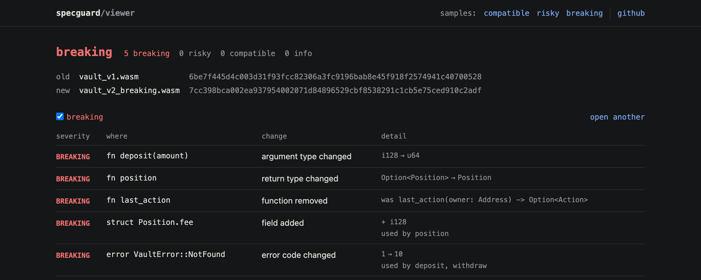

# SpecGuard

Interface compatibility checker for Soroban contracts.

A Soroban contract can replace its Wasm and keep the same address. That is
convenient, but the new code can quietly change the public interface: a
removed function, a different argument type, a changed struct. Apps, generated
bindings and other contracts that call it then break after the upgrade.

SpecGuard compares the contract spec embedded in two Wasm builds (or two
deployed contracts) and reports every interface change as **breaking**,
**risky** or **compatible**. It exits non-zero on breaking changes, so it can
gate a release in CI.

> Status: in development. Not published to npm yet; run it from a clone.

## Usage

```sh
# two local builds
specguard diff old.wasm new.wasm

# a deployed contract against a new build
specguard diff CBQ...XYZ target/wasm32v1-none/release/app.wasm --network testnet

# machine-readable report
specguard diff old.wasm new.wasm --format json > report.json

# print a saved report as markdown
specguard render report.json --format markdown
```

Each side can be a `.wasm` file, a contract id or a Wasm hash. Contract ids and
hashes are fetched read-only over RPC; `--network testnet` and
`--network futurenet` have defaults, mainnet needs `--rpc-url`.

```
$ specguard diff vault_v1.wasm vault_v2_breaking.wasm
old  vault_v1.wasm           6be7f445..0528
new  vault_v2_breaking.wasm  7cc398bc..2adf

BREAKING  fn deposit(amount)          argument type changed
          i128 -> u64
BREAKING  fn position                 return type changed
          Option<Position> -> Position
BREAKING  fn last_action              function removed
          - last_action(owner: Address) -> Option<Action>
BREAKING  struct Position.fee         field added
          + i128
          used by position
BREAKING  error VaultError::NotFound  error code changed
          1 -> 10
          used by deposit, withdraw

5 breaking, 0 risky, 0 compatible, 0 info
result: breaking
```

| Exit code | Meaning |
|---|---|
| 0 | Passed |
| 1 | Breaking changes found (or risky ones, with `--fail-on risky`) |
| 2 | Invalid input or runtime error |

## GitHub Actions

```yaml
- uses: devgoestobar/SpecGuard@main
  with:
    old: ${{ vars.CONTRACT_ID }}        # deployed contract
    new: target/wasm32v1-none/release/my_contract.wasm
    network: testnet
```

The step fails when the new build breaks the interface (`fail-on: risky` to be
stricter) and writes the report to the job summary. Outputs: `verdict`,
`breaking`, `risky`, `report` (path to the JSON report). A complete workflow
that builds the contract first is in
[examples/github-actions/specguard.yml](examples/github-actions/specguard.yml).

## Report viewer

`viewer/` is a static page that renders a JSON report: open
`viewer/index.html` from a clone, or serve the repository and open
`viewer/?report=<url-of-report.json>`. Reports are read in the browser and never
uploaded. Sample reports from the example contracts are in
[examples/reports](examples/reports).



## What it checks

Functions, arguments, return types, custom types (structs, unions, enums),
error enums and contract metadata, all read from the `contractspecv0`,
`contractmetav0` and `contractenvmetav0` sections of the Wasm. Each change is
classified as breaking, risky, compatible or info.

The full rule list, and the reasoning behind each one, is in
[docs/RULES.md](docs/RULES.md).

## What it does not check

- Storage layout or data migrations
- Business logic or security issues
- It never signs, submits or executes an upgrade

A clean report means the callable interface did not break. It does not mean
the upgrade is safe in every other respect.

## Development

Requires Node.js 22.18 or newer.

```sh
npm install
npm test
node src/cli.ts diff fixtures/wasm/vault_v1.wasm fixtures/wasm/vault_v2_breaking.wasm
```

`fixtures/contracts` holds a small vault contract and three upgraded versions
of it (compatible, risky, breaking). The built Wasm is committed in
`fixtures/wasm`, so tests do not need Rust. To rebuild it, install the
`stellar` CLI and run `scripts/build-fixtures.sh`.

## Evidence

| | |
|---|---|
| Comparison engine | [src/compare/diff.ts](src/compare/diff.ts), [src/extract/spec.ts](src/extract/spec.ts), rules in [docs/RULES.md](docs/RULES.md) |
| Example contracts | [fixtures/contracts](fixtures/contracts): a vault contract and three upgrades (compatible, risky, breaking) |
| Tests | 51 tests, see [docs/evidence/test-log.txt](docs/evidence/test-log.txt) and the [ci workflow runs](https://github.com/devgoestobar/SpecGuard/actions/workflows/ci.yml) |
| CI gate | [action.yml](action.yml), [example workflow](examples/github-actions/specguard.yml), and the [action self-test](https://github.com/devgoestobar/SpecGuard/actions/workflows/action.yml), which checks the step fails on the breaking upgrade |
| Reports | [examples/reports](examples/reports) in text, JSON and markdown |
| Screenshots | [docs/evidence/screenshots](docs/evidence/screenshots) |

## License

MIT
