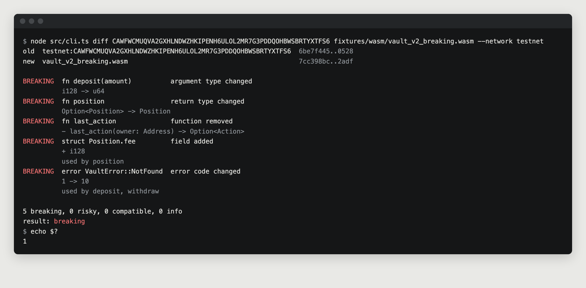

# Testnet run

The example vault contract (v1) is deployed on Stellar testnet, and SpecGuard
compares that live deployment against the upgraded builds. The deployed Wasm
is fetched read-only over RPC; nothing is signed or upgraded by SpecGuard.

| | |
|---|---|
| Contract | [`CAWFWCMUQVA2GXHLNDWZHKIPENH6ULOL2MR7G3PDDQOHBWSBRTYXTFS6`](https://stellar.expert/explorer/testnet/contract/CAWFWCMUQVA2GXHLNDWZHKIPENH6ULOL2MR7G3PDDQOHBWSBRTYXTFS6) |
| Wasm hash on chain | `6be7f445d4c003d31f93fcc82306a3fc9196bab8e45f918f2574941c40700528`, same as `fixtures/wasm/vault_v1.wasm` |
| Upload Wasm | [`3249c3b1dd26669130baeccf7a9193eda9019e7f19f1885be679e688dba47de0`](https://stellar.expert/explorer/testnet/tx/3249c3b1dd26669130baeccf7a9193eda9019e7f19f1885be679e688dba47de0) |
| Create contract | [`510f095c55a10ea31f628ab04c3463614bbe1ddd5edd45f18e3e106b6fecee15`](https://stellar.expert/explorer/testnet/tx/510f095c55a10ea31f628ab04c3463614bbe1ddd5edd45f18e3e106b6fecee15) |

## Results

```sh
node src/cli.ts diff CAWFWCMUQVA2GXHLNDWZHKIPENH6ULOL2MR7G3PDDQOHBWSBRTYXTFS6 \
  fixtures/wasm/vault_v2_breaking.wasm --network testnet
```

| New build | Result | Exit code | Report |
|---|---|---|---|
| `vault_v1.wasm` (same code) | no interface changes | 0 | |
| `vault_v2_compatible.wasm` | compatible | 0 | [text](compatible.txt), [json](compatible.json) |
| `vault_v2_breaking.wasm` | breaking, 5 changes | 1 | [text](breaking.txt), [json](breaking.json) |


